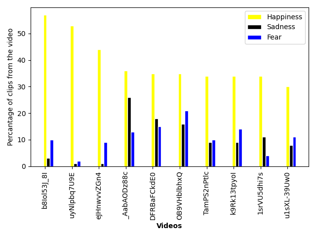
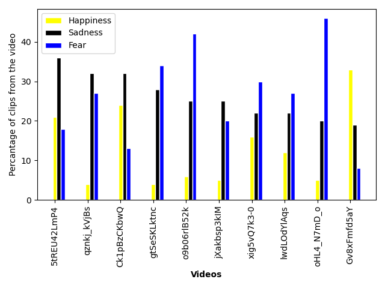

# AI feels emotions
Can AI feels emotions? We do not know the answer. 
But AI defenetly can understand what emotions would humans feel while watching a video.


## Overview

The deep learning neural network was trained using a dataset of 30,751 video ads, each of which was annotated by 75 individuals with the emotions they experienced while watching the video. 
These video ads have been used to extract the dataset of short (5 seconds ) clips that based on the consensus of annotators have evoked the most significant emotional response.
So the dataset for training consisted of short 5-second clips labeled with one of  8 categories (e.g. Happiness, Sadness, Fear, Anger, etc.) based on the consensus of annotators. 
The neural network was trained to distinguish between these clips. More details see [here](Adcumen.pdf).


# How to use it
To annotate video with emotions it would evoke in the watching auditory run:

```bash
# <path_video_file> path to your video , the results will be stored in "output/k/output.mp4" 
# where k is the number of your task
python3 annotate_video.py <path_video_file>
  
```
The result would be stored in "output" folder in subfolder with numeric id.

## Why the annotation is done with random weights?   
The trained network weights for emotion recognition cannot be shared due to the intellectual property issues. 
**If you run the code, the annotation will be done using random weights!!!**. 
To give you an idea of the quality of annotation, several examples of videos annotated using the trained Neural Network have been included.
 

## Example of videos annotated with trained network 

Please see annotated videos in the folders  [Animals_Reunited_With_Owners](Animals_Reunited_With_Owners) and [Heartbreaking_Moments_in_Movies](Heartbreaking_Moments_in_Movies).
The videos are annotated with emotion indicator bars in the low left corner.  

To showcase the ability of the trained model to recognize emotions evoked by a video, several examples have been provided. 
The goal was to create two groups of videos known to evoke strong emotional responses: 
one group to evoke positive emotions (such as happiness or surprise) 
and the other group to evoke significant negative emotions (fear, anger, sadness).

We chose the most highly rated videos on YouTube for our study, 
using two different search criteria. 
To elicit emotions of sadness, anger, or fear, we used the search term "heartbreaking moments in movies part" 
and selected videos that primarily featured short scenes from various films. 
Conversely, to elicit feelings of happiness, 
we searched for "animals reunited with owners" 
and picked videos that mainly showed animals being reunited with their caregivers.



<p align = "left">
Figure 1 - Distribution of emotions in youtube videos collected with search key words "Animals_Reunited_With_Owners". Most 5 seconds clips have been predicted to evoke Happiness.
</p>




<p align = "left">
Figure 2 - Distribution of emotions in youtube videos collected with search key words "Heartbreaking_Moments_in_Movies". Most 5 seconds clips have been predicted to evoke Sadness or Fear.
</p>


<details>
<summary>
Table 1. Distribution of emotions in youtube videos collected with search key words "Animals_Reunited_With_Owners"
</summary>
<p>

| Video           | Duration | Happiness | Sadness | Fear | Anger |
|-----------------|----------|-----------|---------|------|-------|
| b8Iol53J_8I.mp4 |      595 |        57 |       3 |   10 |    14 |
| uyNlpbq7U9E.mp4 |      485 |        53 |       1 |    2 |    11 |
| eJHnwvvZGn4.mp4 |      543 |        44 |       1 |    9 |    23 |
| _AabAODz88c.mp4 |      600 |        36 |      26 |   13 |    20 |
| DFRBaFCkdE0.mp4 |      460 |        35 |      18 |   15 |    25 |
| OB9VHblbhxQ.mp4 |      644 |        35 |      16 |   21 |    18 |
| TamPS2nPtlc.mp4 |      505 |        34 |       9 |   10 |    16 |
| k9Rk13tpyoI.mp4 |      738 |        34 |       9 |   14 |    26 |
| 1srVU5dhi7s.mp4 |      528 |        34 |      11 |    4 |    37 |
| u1sXL-39Uw0.mp4 |      602 |        30 |       8 |   11 |    30 |


</p>
</details>


<details>
<summary>
Table 2. Distribution of emotions in youtube videos collected with search key words "Heartbreaking_Moments_in_Movies"
</summary>
<p>

| Video           | Duration | Happiness | Sadness | Fear | Anger |
|-----------------|----------|-----------|---------|------|-------|
| 5tREU42LmP4.mp4 |      358 |        21 |      36 |   18 |    14 |
| qznkj_kVjBs.mp4 |      196 |         4 |      32 |   27 |    23 |
| Ck1pBzCKbwQ.mp4 |      313 |        24 |      32 |   13 |    14 |
| gtSeSKLktnc.mp4 |      544 |         4 |      28 |   34 |     7 |
| o9b06rlB52k.mp4 |      655 |         6 |      25 |   42 |    13 |
| jXakbsp3kIM.mp4 |      825 |         5 |      25 |   20 |    17 |
| xig5vQ7k3-0.mp4 |      368 |        16 |      22 |   30 |    21 |
| lwdLOdYlAqs.mp4 |      333 |        12 |      22 |   27 |    13 |
| oHL4_N7mD_o.mp4 |      701 |         5 |      20 |   46 |     7 |
| Gv8xFmfd5aY.mp4 |      377 |        33 |      19 |    8 |    22 |


</p>
</details>


## Results
The video is divided into 5-second segments with a 4-second overlap. 
For example, the YouTube video b8Iol53J_8I.mp4 (see table 1, the first row), with a total length of 595 seconds, was divided into 591 segments starting from 0, 1, 2, 3, ..., 590 seconds. 
The emotion elicited by each segment was predicted by a trained network. 
Out of the 591 segments in b8Iol53J_8I.mp4, 57% were predicted to evoke Happiness, while only 3% were predicted to evoke Sadness.

The results for videos from the group "animals reunited with owners" are presented in figure 1 and table 1. 
As one can see Happiness was dominant emotion predicted in videos from this catergory. 

On the opposite (see table 2, figure 2), for videos from the group "heartbreaking moments in movies part" the dominant emotions were Sadness (Fear) while Happiness was sifnificantly under represented.      

